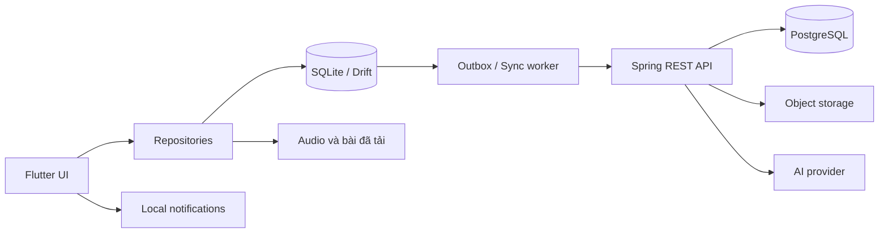

# Kiến trúc dự kiến

## Scaffold Android hiện tại — NO-001

Code ở `apps/mobile/`; lệnh setup/build/test và runtime thực tế tại [mobile README](../apps/mobile/README.md). Flutter 3.44.8/Dart 3.12.2 được pin bằng FVM; JDK 21, Gradle wrapper 9.1.0, AGP 9.0.1, Kotlin plugin 2.3.20. Compile/target SDK 36, min SDK 24 theo Flutter template. App ID dev tạm `com.dorriss.noapp` với suffix `.dev`/`.staging`; chưa chốt identity phát hành.

Shell dùng `go_router` 18.0.2 với bốn StatefulShellBranch, locale tiếng Việt và hai product flavors dev/staging. Tab: Hôm nay, Kho từ, Luyện câu, Khu vườn. Giữ stack trong process khi đổi tab; Android Back pop child route trước, từ tab root khác về Hôm nay, từ root Hôm nay để OS thoát. Chưa có khôi phục stack bền sau process kill.

`app/` giữ app root/router; `core/config/` giữ immutable config từ `appFlavor`; `features/scaffold/` giữ placeholder dùng chung. Không gọi mạng khi bootstrap, không có login wall. Riverpod, Drift, starter/audio, study và sync là kiến trúc đích ở các task sau, chưa được thực hiện bởi scaffold. Tách feature thật khi bắt đầu task tương ứng.

## Stack

- Android-first: Flutter/Dart, Riverpod, SQLite qua Drift, HTTP client; secure storage cho credential, file app-private cho audio/recording.
- Backend: Java + Spring Boot, REST/OpenAPI, Spring Security, PostgreSQL, Flyway. Modular monolith, một deployable ban đầu.
- Audio/gói: object storage tương thích S3; manifest và hash để tải/kiểm tra; local cache có quản lý dung lượng.
- AI: adapter backend, quota + idempotency + timeout; provider/model sẽ chọn sau thử câu tiếng Việt, không khóa vào nhà cung cấp trong domain.
- Auth beta: đề xuất Firebase Authentication Google sign-in; Spring xác minh ID token qua SDK chính thức, ánh xạ external subject → user ID nội bộ. Guest offline không cần Firebase. Chốt cấu hình/region trước khi bật. Không tự viết password/OTP server cho MVP.
- Notifications: local Android trước; chưa triển khai FCM cho lời nhắc thường ngày.
- Chọn/pin phiên bản stable và compatibility trong task setup; không coi version từ tài liệu này là lockfile.



PostgreSQL không public cho mobile. Lượt học ghi local trước. Background sync là tối ưu thêm, không phải điều kiện an toàn dữ liệu; luôn có resume/manual sync.

## Cấu trúc dự kiến

```text
apps/mobile/           Flutter/Drift, chia theo feature
frontend/              Web trong tương lai, chưa scaffold
api/                   Spring Boot/Maven, package theo domain (layout như Vey)
contracts/             OpenAPI, fixtures, JSON schema gói và sync
content/               Bài tự biên soạn, metadata quyền dùng, gói mẫu
compose.yml            Hạ tầng local như Vey
infra/                 Script và deployment configuration
docs/                  Đặc tả, quyết định, tracker mapping
tasks/plan.md          Kế hoạch và chỉ mục
```

Module backend: identity, catalog, learner-library, learning, sync, feedback, privacy. Mỗi task migration có người sở hữu, tránh hai nhánh dùng cùng số phiên bản.

## Mô hình dữ liệu

| Nhóm | Thực thể chính | Quy tắc |
|---|---|---|
| Identity | guest_profile, user, linked_identity, device | Dữ liệu local được scope theo profile; không nhập nhằng hai account |
| Catalog | topic, lexeme, sense, usage_pattern, example, exercise, content_revision | UUID ổn định; revision nội dung bất biến |
| Packaging | pack, pack_revision, asset, download_state | Hash, byte size, content schema version, license |
| Personal | learner_item, personal_note, import_batch | Dữ liệu của người dùng có revision và tombstone |
| Learning | session, session_step, attempt, review_event, review_target, review_state | Attempt append-only; event ID chống trùng; state có thể rebuild |
| Habit | schedule_revision, daily_credit, preferences | Timezone + ngày local + snapshot rule; không ghi cứng Tâm |
| Sync | outbox_operation, inbox_cursor, server_change, conflict | Push theo item ack; pull cursor; atomic apply |
| Feedback | writing_draft, feedback_request, feedback_result, content_report | AI tách khỏi deterministic grade; không tự tăng SRS |

Audio bytes nằm file/object storage, DB lưu metadata/path/hash. Recording tự nghe chỉ local mặc định, không backup/upload nếu chưa có opt-in riêng.

## Hợp đồng API cần định nghĩa trong task NO-003

Namespace `/api/v1`; OpenAPI là nguồn sinh client. Tên endpoint dưới đây là thiết kế, chưa có implementation.

- `GET /catalog/packs`, `GET /catalog/packs/{id}/manifest`: public curated metadata; manifest versioned.
- `GET /me`, `PATCH /me/preferences`: authenticated; private mutation khi offline đi qua sync operations cùng revision contract.
- `POST /sync/push`, `GET /sync/pull?cursor=...`, `GET /sync/snapshot`: auth; payload có schemaVersion, deviceId, operationId.
- `POST /guest-migrations`: yêu cầu xác nhận guest → đúng account; nhận migrationId và mapping, không gửi toàn DB thiếu kiểm soát.
- `POST /feedback/requests`, `GET /feedback/requests/{id}`: private; idempotency key và quota.
- `POST /content-reports`: nội dung/bài hoặc grade bị sai, kèm revision.
- `POST /account-deletion-requests`, `GET /account-deletion-requests/{id}`: re-auth, trạng thái rõ ràng; có web entry cho yêu cầu xóa.

Lỗi dùng problem JSON với code ổn định, field errors và retryability; 401/403/409/422/429 được phân biệt. Giới hạn batch, file size, body size; ownership lấy từ verified subject, không tin userId trong body. Authorization tests phải bao gồm IDOR giữa hai account.

## Quyết định về lịch ôn

Dart tính local để học dài ngày không mạng. Spring giữ event log và replay projection sau sync. Hai bên cùng scheduler/rules version và fixtures; chưa chọn thư viện cụ thể trước NO-004. Không dựa vào AI để quyết định nhớ/quên; không có service ML riêng trong MVP.

## Vận hành

Dev dùng Docker Compose ở root cho API/PostgreSQL, Redis, Kafka, MinIO và công cụ local; staging và production tách DB, bucket, AI quota. Log requestId/operationId không log token, câu riêng tư hay recording. Metrics: lỗi lưu local, sync conflict/duplicate, latency, AI cost/quota. Backup PostgreSQL và bài test restore; secrets ở môi trường triển khai, không trong repo.

## Reference Vey — cập nhật 2026-10-04

Chủ dự án yêu cầu layout tương tự Vey và bật toàn bộ hạ tầng ngay: Redis, Kafka, MinIO, JobRunr, cùng Kafka UI/Dozzle ở local. Maven, JPA, Flyway, AWS SDK S3, Lombok/MapStruct, springdoc và quality tooling lấy Vey làm reference. Flutter/Drift và các bảo đảm offline vẫn giữ nguyên. Scope init mở rộng được mô tả trong `tasks/plan.md`; scaffold backend và evidence ở `docs/backend-scaffold.md`.

Đề xuất cụ thể: modular monolith bằng `common`, `infrastructure`, `modules` trong một Maven project/một JAR. ArchUnit kiểm tra dependency boundaries. Gọi qua interface công khai cho thao tác synchronous; không import internals module khác. Đề xuất khác với Vey: side effects dùng Kafka qua transactional outbox, còn ghi sync operation + dedupe + ack phải atomic trên PostgreSQL. Không để broker/cache quyết định dữ liệu học đã được lưu an toàn. JobRunr dành cho durable backend jobs; nhắc học offline vẫn local Android.
